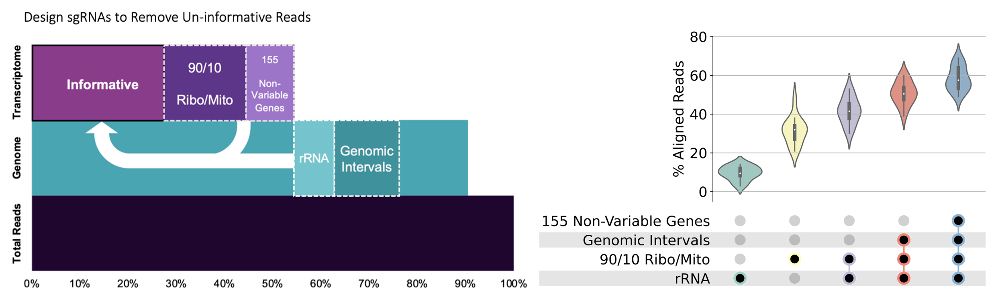
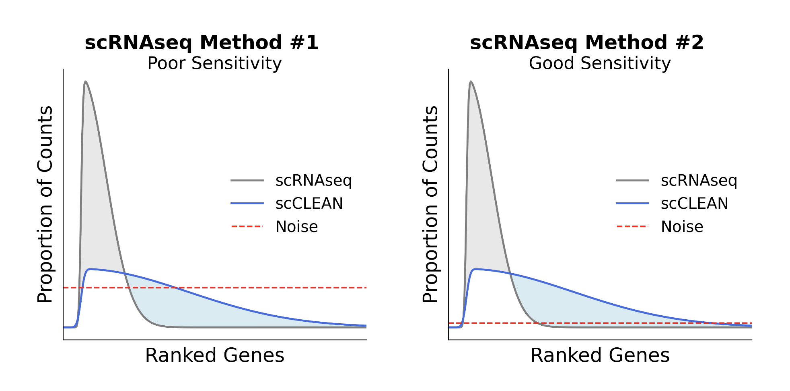

# scCLEAN

**Single-cell CRISPRclean (scCLEAN)** is a molecular approach that globally recomposes single-cell RNA-seq (scRNA-seq) libraries to enhance the detection of less abundant transcripts. By using a CRISPR/Cas9-based depletion strategy, scCLEAN selectively removes a small fraction of highly abundant, low-variance transcripts and other unwanted sequences (e.g., uninformative genomic and rRNA fragments) prior to sequencing. This improves transcriptome complexity and reveals biologically informative, lowly expressed transcripts without the need for deeper sequencing.

This repository contains the code and workflows used to generate all figures and perform all analyses presented in the associated publication.

## Citation

If you find this method and codebase useful, please cite our publication:

- Pandey, A. C., Bezney, J., DeAscanis, D., et al. A CRISPR/Cas9-based enhancement of high-throughput single-cell transcriptomics. 

All data can be found at Gene Expression Omnibus - GSE283554

## Key Features

- **Increased Sensitivity and Complexity:**  
  Depletes a small subset of abundant, non-informative sequences, redistributing ~50% of reads toward rarer, more informative transcripts.
- **Compatible with Standard scRNA-seq Libraries:**  
  Integrates with commonly used 10x Genomics 3' scRNA-seq workflows without specialized instrumentation.
- **Versatility:**  
  Demonstrated across multiple cell types, tissues, and library preparation methods (including Illumina short-read and PacBio MAS-Seq long-read libraries).
- **Broad Applicability:**  
  Offers a foundational set of guide RNAs for use in standard assays, with instructions for customizing guide selection for user-specific datasets.
- **Performance boost not equivalent to deeper sequencing:**
  Gain in sensitivity cannot be re-capitulated by sequencing deeper. By altering the library composition, more biological variance is incorporated into the latent space during computational dimensionality reduction. This isn't recapitulated by simply sequencing more. 

## Best Use Case of scCLEAN

- **In-sufficient Sensitivity:** 
  User performed single cell RNA-seq on a biological condition and doesn't see clear differences between the control and experimental samples.

- **Increased Distinction of Cell Types:** 
  User is expecting a certain cell type within their dataset but it currently cannot be identified. 

- **Identifying Polygenic Signatures:** 
  User is looking to identify biological signatures that are polygenic in nature, or looking to build complex gene regulatory networks. 

## Worst Use Case of scCLEAN

- **Identifying Single Gene Signatures or Cell Markers:** 
  User is looking to identify single gene signatures or single genes as cell specific markers. 255 genes are removed with scCLEAN. While these 255 genes show low variability across tissues and cell types, it does not mean that they don't contain some biological relavance in the user's samples. Please review the list of genes removed (Guides/scCLEAN_255_removed_genes.csv) before applying scCLEAN. 

## Applicability

- **Incorporation:**
  
  scCLEAN is a molecular approach that can be incorporated after or during the generation of single-cell sequencing libraries. Although the provided guide libraries are designed for 10x Genomics 3' single-cell platforms, the underlying principle is adaptable to a wide range of single-cell techniques.

- **Single-Cell RNA-seq:**
  
  scCLEAN was developed and validated on the 10x Genomics Chromium 3' v3 platform. However, it can be applied to various single-cell RNA-seq methods, including:
  - **Plate-based:** Smart-seq, Split-seq, sci-RNA-seq, Parse Bio, Scale Bio, Cel-Seq
  - **Emulsion-based:** PIP-seq, Fluent
  - **Droplet-based:** 10X, inDrops, Drop-seq
  - **Microwell-based:** BD Rhapsody
  
  Each technology differs in sensitivity and library composition. scCLEAN’s benefits are most pronounced with methods that achieve higher sensitivity. For further reference, please see:  
  [Systematic comparison of single-cell and single-nucleus RNA-sequencing methods](https://www.nature.com/articles/s41587-020-0465-8)

  

- **Single-Cell Iso-Seq:**
  
  scCLEAN has been successfully integrated into the PacBio MAS-Seq protocol for full-length isoform sequencing, improving the detection and characterization of low-abundance transcripts.

- **Spatial Transcriptomics:**
  
  scCLEAN is not limited to conventional scRNA-seq and can be adapted for spatially resolved methods like Stereo-seq. For an example, see:  
  [STOmics-GenX: A CRISPR-based approach to improve cell identity-specific gene detection from spatially resolved transcriptomics](https://www.biorxiv.org/content/10.1101/2022.12.08.519589v1)

- **Multi-omics:**
  
  As single-cell studies increasingly integrate multiple modalities (genome, transcriptome, epigenome, proteome), the need to mitigate noise grows. Future work could extend scCLEAN to other data types (e.g., ATAC-seq) to remove uninformative reads and maintain a high signal-to-noise ratio in multi-omic experiments.

## Repository Contents

- **`PBMC_data_files/`**: Individual sample PBMC single cell input data. 
- **`Guides/`**: List of 255 genes being targeted with scCLEAN.
- **`Notebooks/`**: Jupyter notebooks and R Markdown files detailing step-by-step analyses, suitable for adaptation to user data.
  - **`scCLEAN_general_metrics/`**: (Figure 1 and associated Supplementary Figures)
    - Percent of reads being targeted for depletion across public datasets.
    - 255 genes targeted for removal and their relevance within:
      - Tabula Sapiens 161 cell types
      - GTEx bulk tissues
      - Panglao ubiquity index
      - Extended Tau tissue specificity score
      - CellMarker 2.0 dataset
    - Off-target analysis
  - **`PBMC/`**: (Figure 2 and associated Supplementary Figures)
    - Single cell library complexity comparison across:
      - 3 scCLEAN biological replicates
      - 1 control sample
      - 1 control sample deeply sequenced to 80,000 reads per cell
      - 1 in-silico depleted positive control sample
      - 1 control sample from a PBMC scArches reference atlas
    - Pipeline for PBMC QC and processing with automatic Azimuth cell annotations.
    - Deep learning DESC automated sample clustering.
    - scVI scArches PBMC reference integration and performance metrics.
  - **`PBMC_isoseq/`**: (Figure 3 and associated Supplementary Figures)
    - Pipeline for PBMC isoform sequencing QC and processing with automatic Azimuth cell annotations.
  - **`VSMC/`**: (Figures 4 and 5 and associated Supplementary Figures)
    - Coronary and pulmonary sample processing, QC, and doublet detection.
    - Batch integration.
    - CellRank trajectory inference and pseudotime calculation.
    - scFates advanced tree inference and bifurcation analysis.
    - pyScenic regulon analysis and comparison.

## Primary Software
- Scanpy
  - https://github.com/scverse/scanpy
- Pegasus 
  - https://github.com/lilab-bcb/pegasus
- CellRank 
  - https://github.com/theislab/cellrank
- scFates 
  - https://github.com/LouisFaure/scFates
- DESC 
  - https://github.com/eleozzr/desc
- scArches 
  - https://github.com/theislab/scarches/
- scib 
  - https://github.com/theislab/scib
  
  

